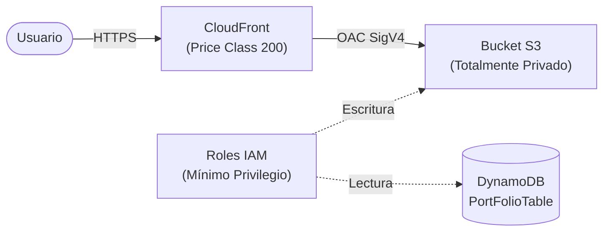
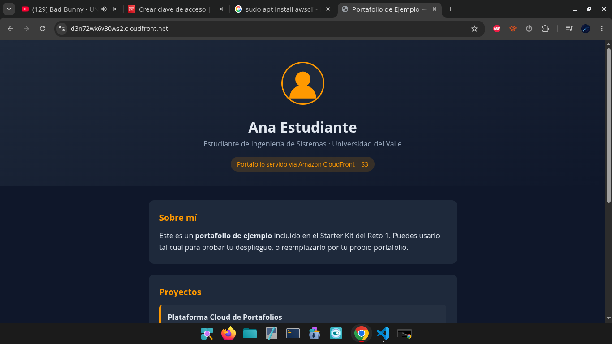
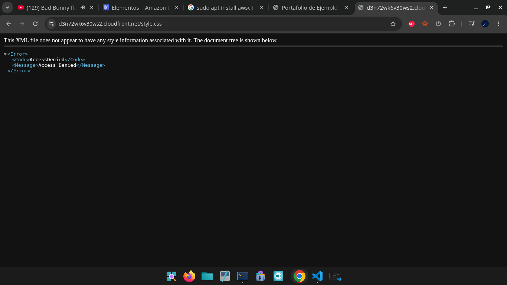
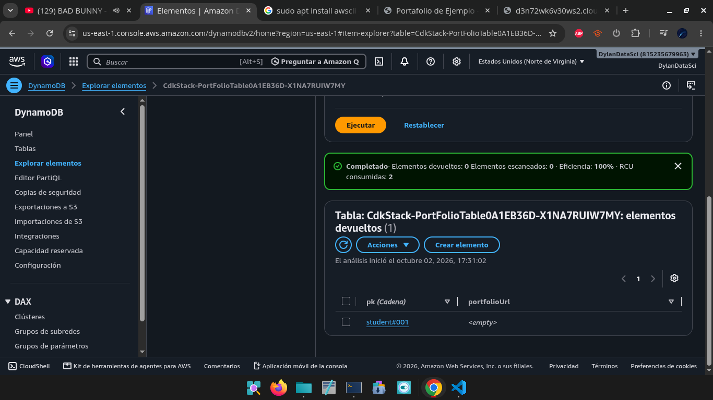

# Arquitectura — Plataforma de Portafolios Estudiantiles

> Plantilla para que documentes **tu** diseño. Complétala a medida que construyes tu stack de CDK.

---

## 1. Diagrama de arquitectura

_Este es un diagrama de referencia. Reemplázalo por el tuyo a medida que diseñas tu stack._

---

## 2. Componentes

| Componente | Servicio AWS | Responsabilidad | Decisiones de diseño |
|---|---|---|---|
| **Almacenamiento** | **S3** | Almacena los archivos estáticos (HTML, CSS, assets) del portafolio. | Bucket privado con `BlockPublicAccess.BLOCK_ALL`. Se configuró `removal_policy=RemovalPolicy.DESTROY` y `auto_delete_objects=True` para vaciar y eliminar el bucket automáticamente al destruir el stack. |
| **CDN** | **CloudFront** | Distribuye el contenido globalmente con baja latencia y alta seguridad. | Conexión al bucket privado usando **Origin Access Control (OAC)** mediante `origins.S3BucketOrigin.with_origin_access_control(bucket)`. Configurado con `default_root_object="index.html"` y optimización geográfica `PriceClass.PRICE_CLASS_200` (Boss Fight). |
| **Metadatos** | **DynamoDB** | Guarda la información y enlaces de los portafolios de los estudiantes. | Uso de `TableV2` en modo serverless (pago por uso). Clave de partición primaria `pk` de tipo `STRING` y política de eliminación `DESTROY` para la gestión limpia del ciclo de vida. |
| **Permisos** | **IAM** | Controla accesos a los recursos bajo el principio de mínimo privilegio. | Creación de roles explícitos en el stack: `DynamoDBReaderRole` con permiso acotado de lectura vía `grant_read_data()` y `S3UploaderRole` con permiso restringido de escritura vía `grant_write()`. |

## 3. Seguridad y acceso

- **¿Cómo garantizas que el bucket no sea accesible directamente (403)?**
  Se configuró el bucket S3 con la opción `block_public_access=s3.BlockPublicAccess.BLOCK_ALL`, lo que bloquea todas las políticas y ACLs públicas a nivel de bucket. Cualquier intento de consulta HTTP directa a la URL nativa de S3 devuelve un error `403 AccessDenied`.

- **¿Cómo accede CloudFront al bucket privado?**
  Se implementó el estándar recomendado por AWS mediante **Origin Access Control (OAC)** usando la construct `origins.S3BucketOrigin.with_origin_access_control(bucket)`. CDK genera automáticamente la política de bucket en S3 que permite exclusivamente a la distribución de CloudFront realizar peticiones `s3:GetObject` mediante firmas SigV4 basadas en el `SourceArn` de la distribución.

- **¿Qué permisos mínimos otorgaste en IAM?**
  Se crearon dos roles IAM específicos aplicando el principio de mínimo privilegio:
  1. **`DynamoDBReaderRole`**: Asumible por servicios como Lambda, restringido únicamente a operaciones de lectura (`grant_read_data()`) sobre el ARN de la tabla `PortFolioTable`.
  2. **`S3UploaderRole`**: Asumible por servicios como Lambda, restringido únicamente a operaciones de carga/escritura (`grant_write()`) sobre el ARN de `PortfolioBucket`.

## 4. Flujo de despliegue

- Lenguaje elegido para CDK: `Python`
- Comando(s) para desplegar: `cdk deploy`
- Comando(s) para destruir: `cdk destroy`

---

## 5. Boss Fight (si lo abordaste)

- ¿Cómo manejaste los archivos **privados** (signed URLs)?
- ¿Qué **Price Class** configuraste y por qué?
- ¿Cómo conviven archivos públicos y privados en tu diseño?

## 📸 Evidencias de Despliegue y Pruebas

### 1. Despliegue Exitoso (CDK Deploy)
*(Inserta una captura de tu terminal con la salida exitosa del `cdk deploy` mostrando el `CfnOutput` con la URL de CloudFront)*

### 2. Acceso Web a través de CloudFront (Prueba 1)
*(Inserta una captura de pantalla del navegador cargando tu portafolio desde el dominio de CloudFront `https://d3n72wk6v30ws2.cloudfront.net`)*

### 3. Verificación de Seguridad en S3 (Prueba 2 - Error 403)
Al intentar acceder directamente a un recurso usando la URL del bucket S3 (`https://d3n72wk6v30ws2.cloudfront.net/style.css`), AWS responde con un error **`403 AccessDenied`**, confirmando que el acceso es 100% privado y exclusivo a través de CloudFront OAC.

### 4. Metadatos en DynamoDB
*(Inserta la captura o confirma el registro insertado en la tabla `PortFolioTable` con la clave `student#001`)

---

